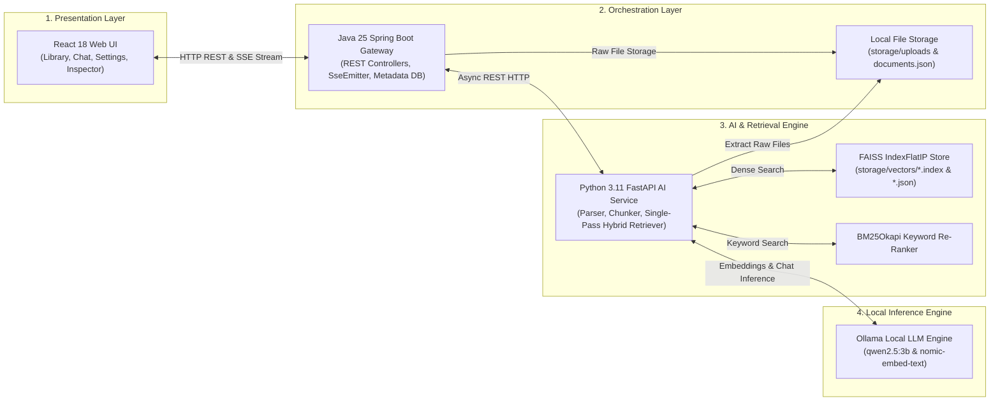

# Canary — Local-First AI Document Intelligence Platform

[](https://openjdk.org/)
[](https://spring.io/projects/spring-boot)
[](https://www.python.org/)
[](https://fastapi.tiangolo.com/)
[](https://react.dev/)
[](https://github.com/facebookresearch/faiss)
[](LICENSE)

**Canary** is a local-first AI document intelligence platform capable of ingesting multi-format documents, indexing text vectors, understanding complex content, and delivering grounded Retrieval-Augmented Generation (RAG) streaming answers with exact citations, running **100% locally** with zero external cloud AI dependencies.

Designed with clean architecture principles, Canary decouples presentation, business orchestration, vector search, and local LLM execution into modular services.

## Architecture Overview

### Document Ingestion & Indexing Pipeline


### System Topology & Component Interactions



### Core Architectural Layers
1. **Frontend (React 18 + Vite)**: Modern responsive web workspace featuring chat dialogue, citation inspection, document library management, active chat tab highlighting, and dynamic dark/light themes.
2. **Backend Gateway (Spring Boot 3.5 / Java 25)**: Manages REST APIs, document lifecycle, multipart upload storage, metadata persistence, and SSE streaming proxying.
3. **AI Engine (Python 3.11 FastAPI)**: Handles multi-format document parsing (PDF, DOCX, TXT, MD), recursive text chunking, FAISS vector indexing, BM25Okapi keyword search, single-pass hybrid re-ranking, and function tool execution.
4. **Local LLM Engine (Ollama)**: Local inference engine running `qwen2.5:3b` for language generation and `nomic-embed-text` for vector embeddings.

## Key Features

- **Hybrid Retrieval (FAISS + BM25)**: Combines dense vector similarity (`IndexFlatIP`) with sparse keyword matching (`BM25Okapi`) using a weighted scoring formula ($0.7 \cdot \text{dense} + 0.3 \cdot \text{bm25}$).
- **Streaming RAG & Citations**: Server-Sent Events (SSE) token streaming with immediate page-level source citation tags (`[Page <N>]`) and interactive Citation Inspector panel.
- **State & Model Persistence**: Automatically persists active model choices, temperature, top-K search range, and similarity thresholds in `localStorage` across page refreshes.
- **Agentic Function Calling**: Autonomous tool execution loop supporting system clock queries, library discovery, and document search.
- **Multi-Format Ingestion**: Ingests PDF, DOCX, Markdown (`.md`), and plain text (`.txt`) documents with async status processing.
- **Containerized Deployment**: Production-ready multi-container setup via Docker and Docker Compose with shared volume storage.

## Tech Stack

- **Backend**: Java 25, Spring Boot 3.5, RestClient, SseEmitter, JUnit 5, Mockito
- **Frontend**: React 18, Vite, Custom Vanilla CSS, Lucide Icons, React Router
- **AI Engine**: Python 3.11, FastAPI, FAISS, rank_bm25, PyPDF, python-docx, Httpx, Pytest
- **Inference & Storage**: Ollama, In-Memory Metadata DB with Atomic File Writes, Local FS
- **Containerization**: Docker, Docker Compose (`hanessn/canary-*`)

## Getting Started

### Prerequisites

1. **Java 25 JDK** & **Maven 3.9+**
2. **Python 3.11+**
3. **Node.js 20+** & **npm**
4. **Ollama** installed locally on your system:
   ```bash
   ollama pull qwen2.5:3b
   ollama pull nomic-embed-text
   ```

### Option A: Running Containerized with Docker Compose

Build and start the complete container stack:

```bash
# Build service images and launch container stack
docker compose up -d
```

Open `http://localhost:3000` in your browser.

To stop the containers:
```bash
docker compose down
```

### Option B: Automation Scripts (Recommended)

Convenient helper scripts are available in the `scripts/` directory for both PowerShell and Bash:

```bash
# Start all local services concurrently
./scripts/run_local.ps1       # PowerShell (Windows)
./scripts/run_local.sh        # Bash (Linux / macOS)

# Build all Docker container images
./scripts/build_docker.ps1
./scripts/build_docker.sh

# Run complete automated test suite across all 3 tiers
./scripts/test_all.ps1
./scripts/test_all.sh
```

### Option C: Running Services Manually

#### 1. Start Python AI Service
```bash
cd ai
# Option 1: Using virtual environment
.venv\Scripts\python.exe -m uvicorn main:app --host 0.0.0.0 --port 8000

# Option 2: Running directly from ai/ directory
uvicorn main:app --port 8000
```

#### 2. Start Java Spring Boot Backend
```bash
cd backend
mvn spring-boot:run
```

#### 3. Start React Frontend
```bash
cd frontend
npm install
npm run dev
```

Open `http://localhost:5173` in your web browser (`http://localhost:3000` when using Docker).

## Running Automated Tests

### Python AI Service Unit & Integration Tests
```bash
cd ai
.venv\Scripts\python.exe -m pytest
```

### Java Backend Integration Tests
```bash
cd backend
mvn clean test
```

## Comprehensive Documentation Sitemap

| Document | Description |
| :--- | :--- |
| 🏗️ [**High-Level Architecture**](docs/ARCHITECTURE.md) | Architectural layers, system topology, and HLD diagram |
| ⚡ [**RAG Pipeline LLD**](docs/RAG_PIPELINE.md) | Low-level design, sequence diagram, intent routing, and hybrid scoring math |
| 🧩 [**Component Architecture**](docs/COMPONENT_DESIGN.md) | Subsystem breakdowns across Frontend, Backend, and AI Engine |
| 🔄 [**Ingestion & Data Flow**](docs/DATA_FLOW.md) | Step-by-step document parsing, chunking, and FAISS indexing flow |
| 🐳 [**Docker Deployment Guide**](docs/DOCKER.md) | Multi-container setup, image tags, volume sharing, and Ollama config |
| 🎯 [**Project Vision**](docs/PROJECT_VISION.md) | Objectives, clean architecture principles, and technology stack |
| 🗺️ [**Roadmap**](docs/ROADMAP.md) | Completed deliverables and future extensibility phases |

## License

This project is licensed under the [Apache License](LICENSE).
