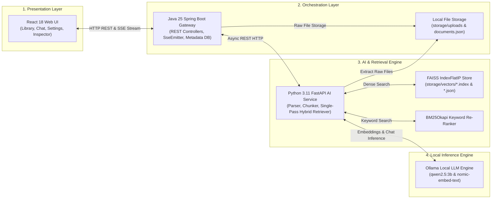

# High-Level Architecture Design (HLD)

Canary is designed as a modular, local-first AI document intelligence platform. The system decouples presentation, business orchestration, vector search, and local LLM inference across three distinct runtime tiers: the **React Web UI**, the **Java Spring Boot Backend Gateway**, and the **Python FastAPI AI Engine**, backed by **FAISS Vector Storage** and the **Ollama LLM Engine**.

## Step-by-Step Architecture Flow Diagram

Below is the structured vector flow diagram displaying the 9-step document ingestion and indexing pipeline:

### 9-Step Document Ingestion & Indexing Pipeline

1. **Upload File**: User selects a file in Web Client UI -> `POST /api/v1/documents`.
2. **Save File**: Java Backend saves raw file to `storage/uploads/`.
3. **Save Metadata**: Java Backend records metadata in `Metadata DB` (`storage/documents.json`) with `status = UPLOADED`.
4. **Trigger Indexing**: Java Backend dispatches `@Async` HTTP call to Python AI Service (`POST /api/v1/index`).
5. **Read File**: Python AI Service reads raw document from `storage/uploads/`.
6. **Parse, Chunk & Embed**: Python AI Service extracts text (PyPDF/python-docx/txt/md), chunks recursively (500 chars, 50 overlap), and fetches embeddings from Ollama (`nomic-embed-text`).
7. **Index Chunks**: Python AI Service builds FAISS `IndexFlatIP` and saves `.index` and `.json` files to `storage/vectors/`.
8. **Return Status**: Python AI Service returns HTTP 200 `success`.
9. **Update Status**: Java Backend updates metadata status to `READY`.

## Numbered RAG Streaming Query Flow Diagram

### 7-Step RAG Streaming Execution Flow

1. **Prompt Submission**: Web Client submits user query to Java Backend (`POST /api/v1/chat/stream`).
2. **Proxy Request**: Java Backend proxies request to Python AI Engine (`POST /api/v1/chat`).
3. **Embed Query**: Python AI Engine fetches query vector from Ollama (`nomic-embed-text`).
4. **FAISS Dense Search**: Performs cosine inner-product search and filters chunks by `similarity_threshold`.
5. **BM25 Keyword Scoring**: Tokenizes text chunks and evaluates sparse BM25 scores.
6. **Hybrid Combination**: Combines scores ($0.7 \cdot \text{Dense} + 0.3 \cdot \text{BM25}$) and selects Top-K chunks.
7. **SSE Token Stream & Citations**: Assembles system prompt with page citations, requests Ollama LLM stream (`qwen2.5:3b`), and streams SSE tokens back to the Web UI.

## Interactive Topology Diagram

## System Topology & Subsystems

### 1. Presentation Layer (React Web Frontend)
- **Framework**: React 18 SPA built with Vite.
- **Role**: Provides an interactive workspace for document library management, live token streaming dialogue, citation inspection, active chat tab highlighting, and RAG control sliders.
- **Communication**: Interacts with Spring Boot via REST APIs and Server-Sent Events (SSE).

### 2. Orchestration Layer (Java Spring Boot Backend)
- **Framework**: Java 25 & Spring Boot 3.5.
- **Role**: Serves as the central API gateway and domain manager. Manages HTTP request validation, file storage on disk (`storage/uploads`), document metadata persistence (`storage/documents.json`), and async HTTP proxying to the AI Engine.

### 3. AI & Retrieval Layer (Python FastAPI Engine)
- **Framework**: Python 3.11 with FastAPI.
- **Role**: Ingests files (PDF, DOCX, TXT, MD), splits text recursively into chunks, computes dense vector embeddings via Ollama (`nomic-embed-text`), manages FAISS `IndexFlatIP` indices on disk (`storage/vectors`), executes single-pass hybrid retrieval (FAISS + BM25Okapi), and streams LLM output with page citations.

### 4. Local Inference Engine (Ollama)
- **Role**: Provides local model inference for text embeddings (`nomic-embed-text`) and language generation (`qwen2.5:3b`). Operates 100% locally with zero cloud AI API dependencies.
