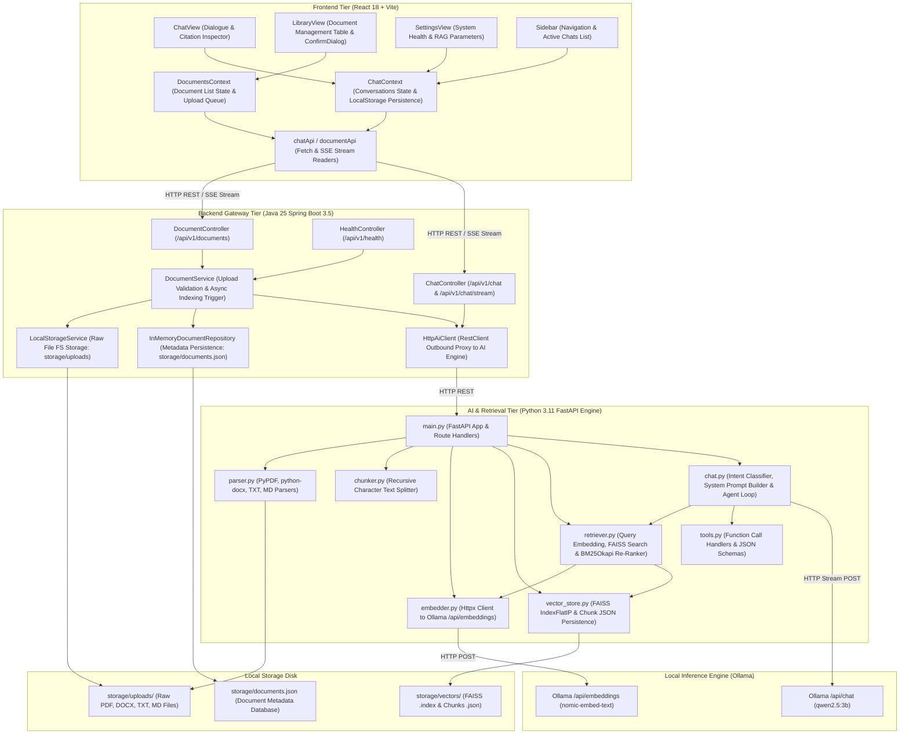

# Subsystem & Component Architecture Design

This document details the modular component structure of Canary across the React Web Frontend, Java Spring Boot Backend Gateway, and Python FastAPI AI Engine.

## Component Architecture Diagram

## Detailed Subsystem Responsibilities

### 1. Presentation Tier (`frontend/src`)
- **`ChatView.jsx`**: Dialogue pane rendering user messages, streaming assistant tokens, loading indicators, active document scope selector, inline chat title editing, and interactive **Citation Inspector** drawer.
- **`LibraryView.jsx`**: Table displaying document library metadata, upload dropzone, refresh trigger, and `ConfirmDialog` modal.
- **`SettingsView.jsx`**: Displays Canary API and Ollama service health, dropdown model selectors (`CustomSelect`), and RAG control sliders (Temperature, Top-K, Similarity Threshold).
- **`Sidebar.jsx`**: Main navigation links, active chat list with visual tab highlighting for selected chat, and system health status lines.
- **`ChatContext.jsx`**: React Context state manager storing conversation histories, active conversation ID, RAG parameters, model selections, and `localStorage` persistence.
- **`DocumentsContext.jsx`**: Manages uploaded document list, upload progress state, background status polling (`UPLOADED` -> `PROCESSING` -> `READY`), and document deletion.

### 2. Backend Gateway Tier (`backend/src/main/java/com/canary/backend`)
- **`DocumentController`**: Handles multipart document uploads, listing, single document retrieval, and deletion requests.
- **`ChatController`**: Exposes synchronous (`POST /api/v1/chat`) and streaming (`POST /api/v1/chat/stream`) chat endpoints using Spring `SseEmitter`.
- **`DocumentService`**: Validates file extensions and size limits, delegates raw file writes to `LocalStorageService`, and triggers `@Async` vector indexing via `HttpAiClient`.
- **`LocalStorageService`**: Manages local filesystem storage (`storage/uploads`).
- **`InMemoryDocumentRepository`**: Thread-safe in-memory store for document metadata, atomically saved to disk (`storage/documents.json`).
- **`HttpAiClient`**: Outbound HTTP client implementing `AiClient`, communicating with the FastAPI AI Engine.

### 3. AI Engine Tier (`ai/`)
- **`main.py`**: FastAPI server exposing endpoints `/api/v1/index`, `/api/v1/retrieve`, `/api/v1/models`, `/api/v1/chat`, `/api/v1/index/{id}`, and `/health`.
- **`parser.py`**: Reads raw files from `storage/uploads/` (PDF via `PyPDF`, DOCX via `python-docx`, TXT/MD via UTF-8 text readers) and returns page numbers and text.
- **`chunker.py`**: Splitting text pages recursively into chunks (chunk size: 500 characters, overlap: 50 characters).
- **`embedder.py`**: Asynchronous HTTP client requesting dense embeddings from Ollama (`nomic-embed-text`).
- **`vector_store.py`**: FAISS index manager creating `IndexFlatIP` indices (`storage/vectors/{id}.index`) and metadata files (`storage/vectors/{id}.json`).
- **`retriever.py`**: Executes dense vector search (FAISS cosine similarity with threshold filtering) combined with sparse keyword re-ranking (`BM25Okapi`) in a single pass.
- **`chat.py`**: Manages intent classification (`classify_intent`), context prompt construction, streaming generator (`_stream_agent_loop`), and tool execution (`execute_tool`).
- **`tools.py`**: Tool functions (`get_system_time`, `list_documents`, `search_documents`) and JSON schemas (`TOOL_SCHEMAS`).
