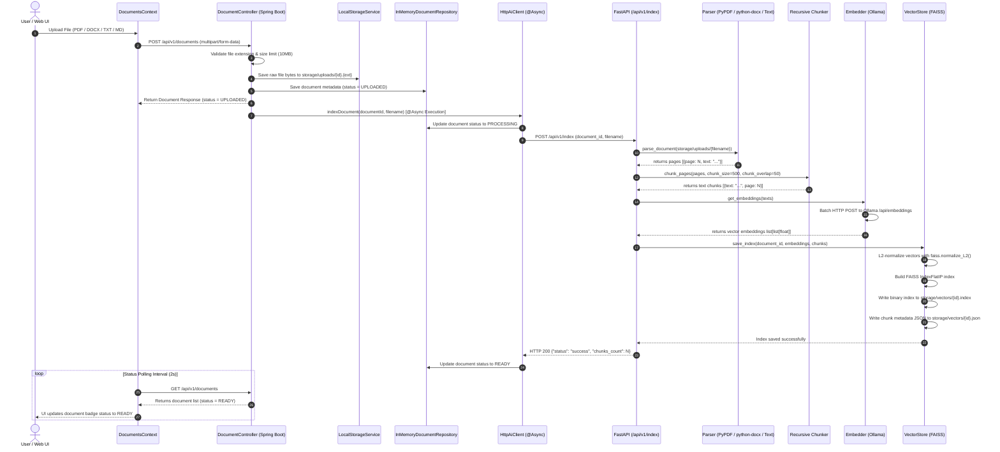

# Ingestion & Vector Indexing Data Flow Sequence

This document describes the end-to-end data flow when a user uploads a new document into Canary.

## Step-by-Step Ingestion & Indexing Flow Diagram

## Detailed Ingestion Sequence Diagram

## Detailed Data Ingestion Pipeline Steps

### 1. Web Upload & Storage Initialization
1. User drops or selects a file in `LibraryView.jsx`.
2. `DocumentsContext` issues a multipart HTTP POST request to `POST /api/v1/documents`.
3. `DocumentController` verifies that the file format is supported (`pdf`, `docx`, `txt`, `md`) and that the file size is under the `10 MB` threshold.
4. `LocalStorageService` writes raw binary contents to `storage/uploads/<documentId>.<ext>`.
5. Metadata is recorded in `InMemoryDocumentRepository` with `status = UPLOADED`.

### 2. Asynchronous Indexing Dispatch
1. `DocumentService` triggers `@Async` method `HttpAiClient.indexDocument(documentId, filename)`.
2. Document status changes to `PROCESSING`.
3. `HttpAiClient` posts JSON payload `{"document_id": "...", "filename": "..."}` to the AI engine at `POST /api/v1/index`.

### 3. Parsing, Chunking & Embedding Generation
1. `parse_document()` opens the raw file from `storage/uploads/` using PyPDF for PDFs, python-docx for DOCX, and UTF-8 text readers for Markdown and TXT files.
2. `chunk_pages()` splits page text recursively into focused chunks (chunk size: 500 characters, overlap: 50 characters).
3. `Embedder.get_embeddings()` posts batch text arrays to local Ollama engine (`nomic-embed-text`).

### 4. FAISS Index & Metadata Storage
1. Vectors are normalized using `faiss.normalize_L2()`.
2. FAISS `IndexFlatIP` inner-product vector index is generated and written to `storage/vectors/{documentId}.index`.
3. Chunk metadata text map is saved to `storage/vectors/{documentId}.json`.
4. AI service returns success response. Backend updates document status to `READY`.
