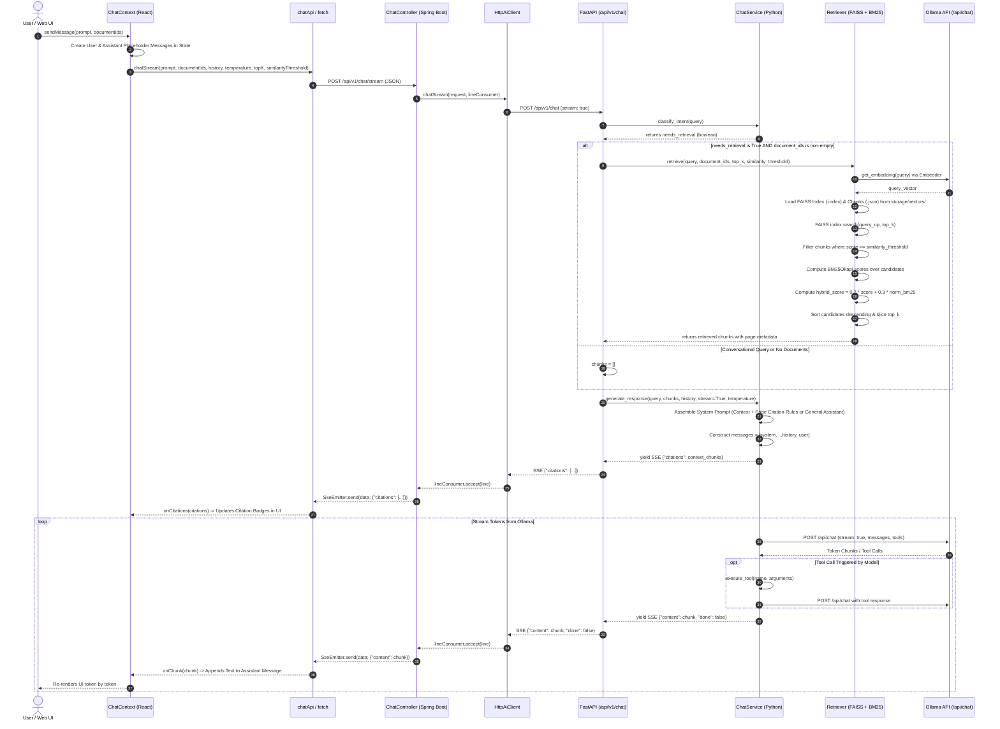

# Low-Level Design (LLD) — RAG Pipeline Execution Flow

This document details the exact sequence of operations during a Retrieval-Augmented Generation (RAG) streaming chat query in Canary, matching the codebase execution in `ChatContext.jsx`, `ChatController.java`, `HttpAiClient.java`, `ai/main.py`, `retriever.py`, and `chat.py`.

## Precise RAG Sequence Diagram

## Detailed Component Logic Breakdown

### 1. Intent Classification (`ChatService.classify_intent`)
Located in `ai/services/chat.py`. Analyzes the query string for standard greetings ("hi", "hello", "who are you"). If the query is conversational and contains no document references, retrieval is bypassed to minimize response latency.

### 2. Single-Pass Hybrid Retrieval (`Retriever.retrieve`)
Located in `ai/services/retriever.py`. Combines dense vector retrieval and sparse keyword re-ranking in a single execution method:

1. **Embedding Query**: Obtains query embedding vector via `Embedder` (`nomic-embed-text`) and normalizes it with `faiss.normalize_L2()`.
2. **FAISS Dense Search**: Loads binary FAISS indices (`.index`) and chunk JSON metadata (`.json`) from `storage/vectors/` for each selected `document_id`. Performs inner product search (`index.search`) and filters out candidates below `similarity_threshold` (default `0.35`).
3. **BM25 Keyword Re-Ranking**: Tokenizes retrieved candidates and query text using `BM25Okapi`.
4. **Hybrid Combination**: Calculates combined score:
   $$\text{Score}_{\text{combined}} = 0.7 \cdot \text{Score}_{\text{FAISS}} + 0.3 \cdot \text{Score}_{\text{BM25\_normalized}}$$
5. **Sorting & Slicing**: Sorts by `combined_score` descending and returns top `top_k` chunks.

### 3. Prompt Construction & Citation Enforcement (`ChatService.generate_response`)
Located in `ai/services/chat.py`.
- Formats context chunks into `--- START CONTEXT ---` blocks marked with `[Page: <N>]`.
- Adds system instructions ordering the model to cite page numbers strictly using `[Page <N>]`.
- Appends conversation history messages `[{role, content}]`.

### 4. SSE Stream Delivery (`api.js` & `ChatController.java`)
- First yields JSON citations `{"citations": [...]}` so citation badges render immediately in the UI.
- Next streams token chunks `{"content": "..."}` as Ollama emits tokens.
- Supports tool execution loop (`get_system_time`, `list_documents`, `search_documents`).
